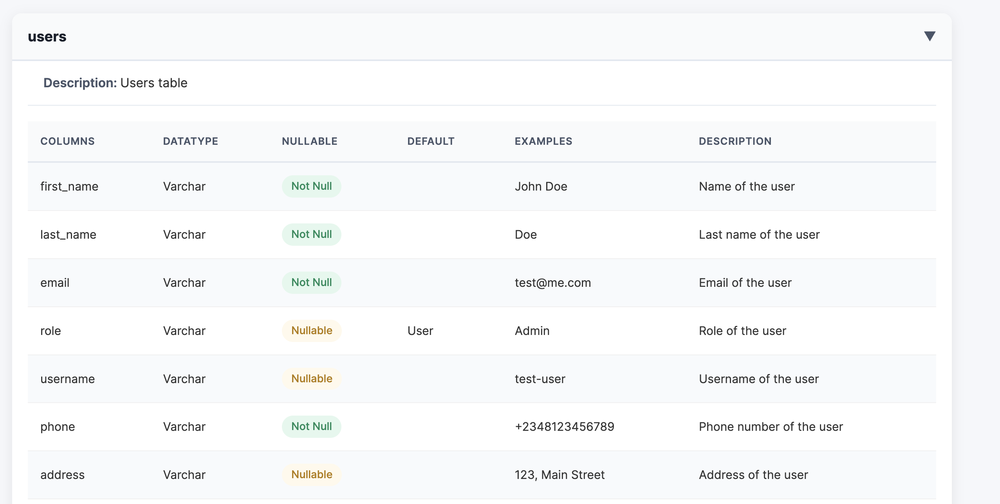

# Entity UI

## Table of Contents

- [Overview](#overview)
- [Installation](#installation)
- [Decorators](#decorators)
  - [`@Table`](#table)
  - [`@Props`](#props)
- [Usage](#usage)
  - [TypeOrm](#typeorm)
  - [Mongoose](#mongoose)
- [Initializing Schema Generator](#initializing-schema-generator)
  - [Express App](#express-app)
  - [Nestjs App](#nestjs-app)
- [API Endpoint](#api-endpoint)
- [Sample Response](#sample-response)
  - [Example Output](#example-output)
- [Use Cases](#use-cases)
- [License](#license)

## Overview

Entity Docs Generator is a TypeScript-based library that automates the creation of entity UI. It provides decorators for defining table and column properties, and dynamically generates an HTML representation of the schema. see example output below



## Installation

To use this library in your project, install it via npm:

```sh
npm install entities-ui
```

### Decorators

#### `@Table`

The `Table` decorator defines metadata for database tables.

#### Properties

| Property          | Type     | Required | Default | Description                                 |
| ----------------- | -------- | -------- | ------- | ------------------------------------------- |
| **`name`**        | `string` | No       | -       | The name of the table in the database       |
| **`description`** | `string` | No       | -       | Human-readable column description for table |

**Example:**

```ts
import { Table, Props } from "entity-generator";

@Table({
  name: "users",
  description: "Users table",
})
class TestUser {
  first_name: string;
  last_name: string;
}
```

#### `@Props`

The `Props` decorator defines column properties for a table.

#### Properties

| Property          | Type                | Required | Default | Description                                                              |
| ----------------- | ------------------- | -------- | ------- | ------------------------------------------------------------------------ |
| **`name`**        | `string`            | No       | -       | The name of the column in the database table                             |
| **`type`**        | `SqlDataType`       | **Yes**  | -       | The SQL data type for the column (e.g., `VARCHAR`, `INTEGER`, `BOOLEAN`) |
| **`nullable`**    | `boolean \| string` | No       | `false` | Whether the column allows NULL values.                                   |
| **`default`**     | `any`               | No       | -       | Default value for the column.                                            |
| **`primary_key`** | `boolean`           | No       | `false` | Whether the column is a PRIMARY KEY                                      |
| **`indexed`**     | `boolean`           | No       | `false` | Whether to create an index for this column                               |
| **`example`**     | `any`               | No       | -       | Example value for documentation purposes                                 |
| **`description`** | `string`            | No       | -       | Human-readable column description for documentation                      |

## Example Usage

**Example:**

```ts
class Product {
  @Props({
    type: "String",
    name: "first_name",
    nullable: false,
    example: "John",
    description: "First name of the user",
  })
  first_name: string;
  @Props({
    type: "String",
    name: "last_name",
    nullable: false,
    example: "Doe",
    description: "Last name of the user",
  })
  last_name: string;
}
```

### TypeOrm

```ts
@Table({
  name: "users",
  description: "Users table",
})
@Entity()
class User {
  @Column({
    type: "varchar",
  })
  @Props({
    type: "String",
    name: "first_name",
    nullable: false,
    example: "John",
    description: "First name of the user",
  })
  first_name: string;

  @Column({
    type: "varchar",
  })
  @Props({
    type: "String",
    name: "last_name",
    nullable: false,
    example: "Doe",
    description: "Last name of the user",
  })
  last_name: string;
}
```

### Mongoose

```ts
@Table({
  name: "users",
  description: "Users table",
})
@Schema({ timestamps: true })
export class Product extends Document {
  @Prop({
    type: String,
  })
  @Props({
    type: "String",
    name: "first_name",
    nullable: false,
    example: "John",
    description: "First name of the user",
  })
  first_name: string;

  @Prop({
    type: String,
  })
  @Props({
    type: "String",
    name: "last_name",
    nullable: false,
    example: "Doe",
    description: "Last name of the user",
  })
  last_name: string;
}
```

### Initializing Schema Generator

To generate documentation, initialize the `EntityGenerator` with the defined entities and the Express app instance.

### Express App

```ts
import { express } from "express";

const schema = EntityGenerator.initialize([User, Product], app)
  .addEntities()
  .setTitle("Entity UI")
  .setDescription(
    "This document provides an overview of all database tables and their columns."
  )
  .setVersion("0.0.1")
  .build();
const app = express();
app.get("/api-docs", (req, res) => {
  res.send(schema);
});
```

### Nestjs App

```ts
async function bootstrap() {
  const app = await NestFactory.create(AppModule);
  const schemas = EntityGenerator.initialize([Users])
    .setTitle("Entity UI")
    .setDescription(
      "This document provides an overview of all database tables and their columns."
    )
    .setVersion("0.0.1")
    .build();

  const expressApp = app.getHttpAdapter().getInstance();
  expressApp.get("/api-docs", (req, res) => res.send(schemas));

  await app.listen(process.env.PORT ?? 3000);
}
bootstrap();
```

## API Endpoint

The schema documentation will be accessible via:

```ts
app.get("/api-docs", (_req, res) => {
  res.send(schema);
});
```

## Use Cases

- **Database Documentation**: Automatically generate schema documentation UI for your database tables.
- **API Development**: Define structured metadata for your database and expose it via an endpoint.
- **Data Validation**: Ensure consistency in table and column definitions across projects.

## License

This library is licensed under the MIT License.
